# Contributing

This document is for ULinkActor framework contributors. For user-facing introductions, quick starts, and feature descriptions, see [README.md](./README.md).

---

# Design Positioning

The core idea of ULinkActor is:

```text
message-driven service runtime
```

It is not:

```text
enterprise distributed actor platform
```

Design constraints:

- Keep the core small.
- Prefer single-process runtime scenarios.
- One actor owns one mailbox.
- Each actor processes messages sequentially.
- Actor state should usually be lock-free.
- Support Send.
- Support Call<T>.
- Support timers.
- Support backpressure.
- Build on TPL Dataflow.
- Prefer compile-time source generation over runtime reflection for API ergonomics.
- Keep source generators and analyzers as compile-time assets, not runtime dependencies.
- Do not introduce MMO business concepts into the core.
- Do not depend on Unity.
- Do not bind the core to a network protocol.
- Do not use dynamic proxies, runtime reflection, or `MethodInfo.Invoke` as a required path for actor dispatch, actor discovery, generated proxy calls, or request/response binding.

The core model comes from skynet:

```text
service = mailbox + state + message handler
```

Each actor:

- Owns its state.
- Owns its mailbox.
- Communicates only through messages.
- Processes messages sequentially.

Because of this, state inside a single actor usually does not need `lock`, `ConcurrentDictionary`, or CAS-style concurrency protection.

---

# Source Generation And Reflection

Source generation is considered part of the intended ULinkActor developer experience. It should be used to remove repetitive code, improve IDE completion, and keep actor APIs strongly typed while preserving the small runtime model.

The runtime model remains:

```text
typed generated API -> ActorRef / ActorSystem -> mailbox -> actor handler
```

Generated code should call normal public runtime APIs such as `Spawn`, `Send`, and `Call<T>`. It should not depend on runtime method lookup, dynamic invocation, dynamic proxy libraries, or reflection-driven dispatch.

Roslyn dependencies must stay in generator or analyzer projects. The `ULinkActor` runtime assembly must not reference Roslyn packages. If generators or analyzers are distributed through the main `ULinkActor` NuGet package, they should be packed under analyzer paths such as:

```text
analyzers/dotnet/cs
```

This keeps the user installation simple while preserving zero runtime cost.

Acceptable compile-time generation targets include:

- Typed spawn extension methods.
- Strongly typed request/response helpers.
- Optional actor client or proxy code that lowers method-like calls into `Send` or `Call<T>`.
- Diagnostics that catch unsafe actor usage at compile time.

Avoid adding runtime reflection-based alternatives unless they are optional tooling paths and not part of normal dispatch.

---

# GeekServer Design Takeaways

GeekServer is useful as a reference for game-server actor ergonomics, but ULinkActor should only absorb ideas that fit the core boundary.

Good candidates for ULinkActor Core:

- Compile-time generated actor APIs instead of runtime proxy/reflection machinery.
- Actor call-chain diagnostics for self-calls, circular awaits, and timeout root-cause analysis.
- Lightweight lifecycle hooks for startup and shutdown work.
- System-level scheduling that still delivers messages through actor mailboxes.

Good candidates for ULinkGame or application code:

- Entity / Component / State modeling.
- Hotfix agent architecture.
- Transparent persistence.
- Idle game-data eviction.
- Game events, Gate / Realm / Scene / AOI, protocol and config tooling.

The default stance is to keep ULinkActor as the actor/mailbox runtime and place game-domain infrastructure in higher layers.

---

# Development Plan

Current source generation and runtime ergonomics plan:

| Status | Task |
| --- | --- |
| 已完成 | Document that source generation is the preferred API ergonomics path and runtime reflection is not part of the normal actor dispatch path. |
| 已完成 | Package `ULinkActor.SourceGenerator` as a compile-time analyzer asset inside the main `ULinkActor` package. |
| 已完成 | Keep Roslyn dependencies out of the `ULinkActor` runtime assembly. |
| 已完成 | Add compile-time diagnostics for actor self-calls and blocking waits inside actor types. |
| 已完成 | Add compile-time diagnostics for discarded `Call<T>` request results. |
| 已完成 | Add optional generated actor client/proxy APIs that lower method-like calls into `Send` and `Call<T>` without runtime reflection. |
| 已完成 | Add compile-time diagnostics for unsupported `[ActorClient]` interface shapes. |
| 待办 | Add actor call-chain diagnostics for circular awaits and timeout root-cause analysis. |
| 待办 | Evaluate lightweight actor lifecycle hooks for startup and shutdown work. |
| 待办 | Evaluate system-level scheduling that still delivers messages through actor mailboxes. |

Completed items in this table should reflect implemented repository behavior, not only design intent.

---

# Current Status

v0.1 is complete.

Included capabilities:

- ActorSystem / ActorRef / ActorId
- IActor / ActorContext
- Send
- Call<T>
- Timer
- Mailbox
- Sequential Execution
- Bounded Mailbox Backpressure
- Graceful Shutdown
- Dead Letter
- Mailbox Metrics
- Slow Message Detection
- Configurable Capacity
- Typed Actor Wrapper
- Diagnostics
- Tracing
- Source Generator
- Compile-time Actor Usage Analyzer
- Generated Actor Client Proxy
- Named Actor
- Local Registry
- Actor Group
- Unit Tests
- .NET 10 / .slnx project structure

---

# Project Structure

```mermaid
flowchart TB
    Runtime["src/ULinkActor"]

    Runtime --> PublicApi["Public API"]
    PublicApi --> ActorSystem["ActorSystem"]
    PublicApi --> ActorRef["ActorRef / ActorRef<TMessage>"]
    PublicApi --> ActorId["ActorId"]
    PublicApi --> ActorContract["IActor / IActor<TMessage>"]
    PublicApi --> ActorContext["ActorContext"]
    PublicApi --> ActorGroup["ActorGroup / ActorGroup<TMessage>"]

    Runtime --> MailboxRuntime["Mailbox Runtime"]
    MailboxRuntime --> ActorCell["ActorCell"]
    MailboxRuntime --> Mailbox["Mailbox"]
    MailboxRuntime --> Envelope["Envelope"]
    MailboxRuntime --> ActorTimer["ActorTimer"]

    Runtime --> Options["Configuration"]
    Options --> ActorSystemOptions["ActorSystemOptions"]
    Options --> ActorSpawnOptions["ActorSpawnOptions"]

    Runtime --> TypedActor["Typed Actor"]
    TypedActor --> TypedActorAdapter["TypedActorAdapter"]

    Runtime --> Observability["Observability"]
    Observability --> MailboxMetrics["MailboxMetrics"]
    Observability --> SlowMessage["SlowMessage"]
    Observability --> DeadLetter["DeadLetter"]
    Observability --> Diagnostics["ULinkActorDiagnostics"]
```



`src/ULinkActor.SourceGenerator` provides typed spawn extension method generation. `tests/ULinkActor.Tests` covers core runtime behavior and source generator behavior.

---

# Engineering Conventions

## Target Framework

Only .NET 10 is supported:

```xml
<TargetFramework>net10.0</TargetFramework>
```

## Solution

The repository uses the .NET 10 `.slnx` solution format:

```text
ULinkActor.slnx
```

## Version

Current package versions:

```text
ULinkActor: 0.1.7
ULinkActor.SourceGenerator: internal compile-time project, not a standalone NuGet package
```

`ULinkActor` 0.1.3 and later packages the source generator as a compile-time analyzer asset. `src/ULinkActor.SourceGenerator` is retained as an internal build project so Roslyn dependencies stay out of the runtime assembly, but it is not independently packable and should not be published as a standalone NuGet package.

## Repository

[bruce48x/ULinkActor](https://github.com/bruce48x/ULinkActor)

Related projects:

- [bruce48x/ULinkRPC](https://github.com/bruce48x/ULinkRPC)
- [bruce48x/ULinkGame](https://github.com/bruce48x/ULinkGame)

## Dependencies

The `ULinkActor` runtime targets .NET 10 only and does not declare an extra `System.Threading.Tasks.Dataflow` package reference.

`ULinkActor.SourceGenerator` uses Roslyn:

```xml
<PackageReference Include="Microsoft.CodeAnalysis.CSharp" Version="4.12.0" PrivateAssets="all" />
```

---

# Test Coverage

- Send dispatches messages.
- Call<T> returns responses.
- Call<T> times out.
- Mailboxes preserve send order.
- A single actor does not execute messages concurrently.
- Timer messages are processed sequentially through the mailbox.
- Bounded mailboxes produce backpressure.
- Stop drains already queued messages.
- Sends after stop go to dead letters.
- Per-actor mailbox capacity overrides are supported.
- Mailbox metric snapshots are available.
- Slow message detection works.
- Typed actor wrappers work.
- ActivitySource tracing is emitted.
- Named actor / local registry behavior works.
- Actor groups work.
- Source generator typed spawn extensions are emitted.
- Source generator actor client proxies are emitted.
- Actor client generator reports unsupported interface shapes.
- Actor usage analyzer reports self-calls, blocking waits, and discarded request calls.

---

# Development Boundaries

The following are not part of ULinkActor Core:

- Cluster
- Remote Actor
- Virtual Actor
- Actor Persistence
- Event Sourcing
- Supervisor Tree
- MMO templates
- Gate / Realm / Map / AOI
- Unity integration
- Database abstractions
- ORM
- Network protocols
- Transport
- RPC

These concerns should be handled by [ULinkGame](https://github.com/bruce48x/ULinkGame), [ULinkRPC](https://github.com/bruce48x/ULinkRPC), or application code. Do not introduce these concepts into the core API when modifying the runtime.
