# Contributing

This document is for ULinkActor framework contributors. For user-facing introductions, quick starts, and feature descriptions, see [README.md](./README.md).

---

# Design Positioning

The core idea of ULinkActor is:

```text
message-driven service runtime
```

It is not:

```text
enterprise distributed actor platform
```

Design constraints:

- Keep the core small.
- Prefer single-process runtime scenarios.
- One actor owns one mailbox.
- Each actor processes messages sequentially.
- Actor state should usually be lock-free.
- Support Send.
- Support Call<T>.
- Support timers.
- Support backpressure.
- Build on TPL Dataflow.
- Do not introduce MMO business concepts into the core.
- Do not depend on Unity.
- Do not bind the core to a network protocol.

The core model comes from skynet:

```text
service = mailbox + state + message handler
```

Each actor:

- Owns its state.
- Owns its mailbox.
- Communicates only through messages.
- Processes messages sequentially.

Because of this, state inside a single actor usually does not need `lock`, `ConcurrentDictionary`, or CAS-style concurrency protection.

---

# Current Status

v0.1 is complete.

Included capabilities:

- ActorSystem / ActorRef / ActorId
- IActor / ActorContext
- Send
- Call<T>
- Timer
- Mailbox
- Sequential Execution
- Bounded Mailbox Backpressure
- Graceful Shutdown
- Dead Letter
- Mailbox Metrics
- Slow Message Detection
- Configurable Capacity
- Typed Actor Wrapper
- Diagnostics
- Tracing
- Source Generator
- Named Actor
- Local Registry
- Actor Group
- Unit Tests
- .NET 10 / .slnx project structure

---

# Project Structure

```mermaid
flowchart TB
    Runtime["src/ULinkActor"]

    Runtime --> PublicApi["Public API"]
    PublicApi --> ActorSystem["ActorSystem"]
    PublicApi --> ActorRef["ActorRef / ActorRef<TMessage>"]
    PublicApi --> ActorId["ActorId"]
    PublicApi --> ActorContract["IActor / IActor<TMessage>"]
    PublicApi --> ActorContext["ActorContext"]
    PublicApi --> ActorGroup["ActorGroup / ActorGroup<TMessage>"]

    Runtime --> MailboxRuntime["Mailbox Runtime"]
    MailboxRuntime --> ActorCell["ActorCell"]
    MailboxRuntime --> Mailbox["Mailbox"]
    MailboxRuntime --> Envelope["Envelope"]
    MailboxRuntime --> ActorTimer["ActorTimer"]

    Runtime --> Options["Configuration"]
    Options --> ActorSystemOptions["ActorSystemOptions"]
    Options --> ActorSpawnOptions["ActorSpawnOptions"]

    Runtime --> TypedActor["Typed Actor"]
    TypedActor --> TypedActorAdapter["TypedActorAdapter"]

    Runtime --> Observability["Observability"]
    Observability --> MailboxMetrics["MailboxMetrics"]
    Observability --> SlowMessage["SlowMessage"]
    Observability --> DeadLetter["DeadLetter"]
    Observability --> Diagnostics["ULinkActorDiagnostics"]
```



`src/ULinkActor.SourceGenerator` provides typed spawn extension method generation. `tests/ULinkActor.Tests` covers core runtime behavior and source generator behavior.

---

# Engineering Conventions

## Target Framework

Only .NET 10 is supported:

```xml
<TargetFramework>net10.0</TargetFramework>
```

## Solution

The repository uses the .NET 10 `.slnx` solution format:

```text
ULinkActor.slnx
```

## Version

Current package versions:

```text
ULinkActor: 0.1.2
ULinkActor.SourceGenerator: 0.1.1
```

## Repository

[bruce48x/ULinkActor](https://github.com/bruce48x/ULinkActor)

Related projects:

- [bruce48x/ULinkRPC](https://github.com/bruce48x/ULinkRPC)
- [bruce48x/ULinkGame](https://github.com/bruce48x/ULinkGame)

## Dependencies

The `ULinkActor` runtime targets .NET 10 only and does not declare an extra `System.Threading.Tasks.Dataflow` package reference.

`ULinkActor.SourceGenerator` uses Roslyn:

```xml
<PackageReference Include="Microsoft.CodeAnalysis.CSharp" Version="4.12.0" PrivateAssets="all" />
```

---

# Test Coverage

- Send dispatches messages.
- Call<T> returns responses.
- Call<T> times out.
- Mailboxes preserve send order.
- A single actor does not execute messages concurrently.
- Timer messages are processed sequentially through the mailbox.
- Bounded mailboxes produce backpressure.
- Stop drains already queued messages.
- Sends after stop go to dead letters.
- Per-actor mailbox capacity overrides are supported.
- Mailbox metric snapshots are available.
- Slow message detection works.
- Typed actor wrappers work.
- ActivitySource tracing is emitted.
- Named actor / local registry behavior works.
- Actor groups work.
- Source generator typed spawn extensions are emitted.

---

# Development Boundaries

The following are not part of ULinkActor Core:

- Cluster
- Remote Actor
- Virtual Actor
- Actor Persistence
- Event Sourcing
- Supervisor Tree
- MMO templates
- Gate / Realm / Map / AOI
- Unity integration
- Database abstractions
- ORM
- Network protocols
- Transport
- RPC

These concerns should be handled by [ULinkGame](https://github.com/bruce48x/ULinkGame), [ULinkRPC](https://github.com/bruce48x/ULinkRPC), or application code. Do not introduce these concepts into the core API when modifying the runtime.
