```mermaid
flowchart TB
    Runtime["src/ULinkActor"]

    Runtime --> PublicApi["Public API"]
    PublicApi --> ActorSystem["ActorSystem"]
    PublicApi --> ActorRef["ActorRef / ActorRef<TMessage>"]
    PublicApi --> ActorId["ActorId"]
    PublicApi --> ActorContract["IActor / IActor<TMessage>"]
    PublicApi --> ActorContext["ActorContext"]
    PublicApi --> ActorGroup["ActorGroup / ActorGroup<TMessage>"]

    Runtime --> MailboxRuntime["Mailbox Runtime"]
    MailboxRuntime --> ActorCell["ActorCell"]
    MailboxRuntime --> Mailbox["Mailbox"]
    MailboxRuntime --> Envelope["Envelope"]
    MailboxRuntime --> ActorTimer["ActorTimer"]

    Runtime --> Options["Configuration"]
    Options --> ActorSystemOptions["ActorSystemOptions"]
    Options --> ActorSpawnOptions["ActorSpawnOptions"]

    Runtime --> TypedActor["Typed Actor"]
    TypedActor --> TypedActorAdapter["TypedActorAdapter"]

    Runtime --> Observability["Observability"]
    Observability --> MailboxMetrics["MailboxMetrics"]
    Observability --> SlowMessage["SlowMessage"]
    Observability --> DeadLetter["DeadLetter"]
    Observability --> Diagnostics["ULinkActorDiagnostics"]
```

# Contributing

本文档面向 ULinkActor 框架开发者。面向框架使用者的介绍、快速开始和能力说明见 [README.md](./README.md)。

---

# 设计定位

ULinkActor 的核心思想是：

```text
message-driven service runtime
```

而不是：

```text
enterprise distributed actor platform
```

设计约束：

- 核心极小
- 单进程优先
- 一个 actor 一个 mailbox
- actor 内部串行执行
- 天然无锁状态
- 支持 Send
- 支持 Call<T>
- 支持 Timer
- 支持 Backpressure
- 基于 TPL Dataflow
- 不引入 MMO 业务概念
- 不依赖 Unity
- 不绑定网络协议

核心模型来自 skynet：

```text
service = mailbox + state + message handler
```

每个 actor：

- 拥有自己的状态
- 拥有自己的 mailbox
- 只能通过消息通信
- 内部顺序执行

因此同一个 actor 内通常不需要 `lock`、`ConcurrentDictionary` 或 CAS 来保护业务状态。

---

# 当前状态

v0.1 已开发完成。

已包含：

- ActorSystem / ActorRef / ActorId
- IActor / ActorContext
- Send
- Call<T>
- Timer
- Mailbox
- Sequential Execution
- Bounded Mailbox Backpressure
- Graceful Shutdown
- Dead Letter
- Mailbox Metrics
- Slow Message Detection
- Configurable Capacity
- Typed Actor Wrapper
- Diagnostics
- Tracing
- Source Generator
- Named Actor
- Local Registry
- Actor Group
- Unit Test
- .NET 10 / .slnx 项目结构

---

# 项目结构



`src/ULinkActor.SourceGenerator` 独立提供 typed spawn 扩展方法生成器；`tests/ULinkActor.Tests` 覆盖 runtime 与 source generator 的核心行为。

---

# 工程约定

## Target Framework

仅支持 .NET 10：

```xml
<TargetFramework>net10.0</TargetFramework>
```

## Solution

使用 .NET 10 `.slnx`：

```text
ULinkActor.slnx
```

## Version

当前包版本：

```text
ULinkActor: 0.1.1
ULinkActor.SourceGenerator: 0.1.0
```

## Repository

[bruce48x/ULinkActor](https://github.com/bruce48x/ULinkActor)

相关项目：

- [bruce48x/ULinkRPC](https://github.com/bruce48x/ULinkRPC)
- [bruce48x/ULinkGame](https://github.com/bruce48x/ULinkGame)

## 依赖

`ULinkActor` runtime 仅面向 .NET 10，不额外声明 `System.Threading.Tasks.Dataflow` 包引用。

`ULinkActor.SourceGenerator` 使用 Roslyn：

```xml
<PackageReference Include="Microsoft.CodeAnalysis.CSharp" Version="4.12.0" PrivateAssets="all" />
```

---

# 测试覆盖

- Send 派发消息
- Call<T> 返回响应
- Call<T> 超时
- mailbox 按发送顺序执行
- 同一个 actor 不并发执行
- timer 消息通过 mailbox 串行执行
- bounded mailbox 产生 backpressure
- Stop drain 已入队消息
- stop 后发送消息进入 dead letter
- per-actor mailbox capacity 覆盖
- mailbox metrics 快照
- slow message detection
- typed actor wrapper
- ActivitySource tracing
- named actor / local registry
- actor group
- source generator typed spawn extension

---

# 开发边界

以下内容不属于 ULinkActor Core：

- Cluster
- Remote Actor
- Virtual Actor
- Actor Persistence
- Event Sourcing
- Supervisor Tree
- MMO 模板
- Gate / Realm / Map / AOI
- Unity 集成
- 数据库抽象
- ORM
- 网络协议
- Transport
- RPC

这些应由 [ULinkGame](https://github.com/bruce48x/ULinkGame)、[ULinkRPC](https://github.com/bruce48x/ULinkRPC) 或业务层解决。修改 runtime 时不要把这些概念引入 core API。
